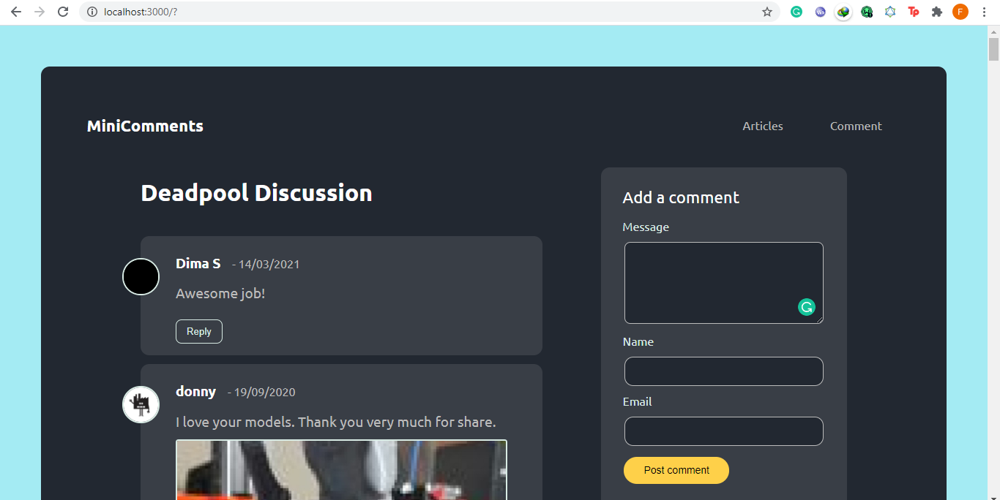
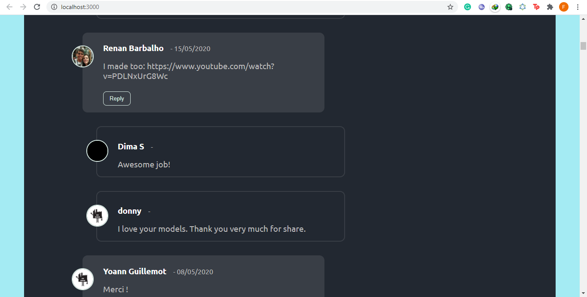

### A simple comments and reply app

This is a frontEnd application that allows a user to view comments, attachments and replies




### Table of Contents

- [Getting Started](#getting-started)
- [Technology Stack](#technology-stack)
- [Installation](#installation)
- [Questions](#questions)
- [Support or Contribution](#support-or-contribution)
- [Status](#status)

##### Getting Started
This is a clientside javascript application built with [React JS](https://reactjs.org/). The data exists on endpoints served through [MyMiniFactory API](https://www.myminifactory.com/api/v2/objects/65076/comments)


#### Technology Stack

**Client Side**
1. React JS


#### Installation

1. Install [**Node JS**](https://nodejs.org/en/).

2. Clone the [**repository here**](https://github.com/fegoworks/comments-app)
3. [**cd**] into the root of the **project directory**.
4. Run `npm run install` on the terminal to install project dependecies

5. Start the application:

##### For Client
**Development**
```
npm run start
```
- Navigate to `http://localhost:3000`


#### DesignGuide

UI Implementation is done using the [Atomic Design Pattern](http://atomicdesign.bradfrost.com/chapter-2/)

#### Questions
For more details contact fegoworks@hotmail.com

#### Support or Contribution
For any suggestions or contributions or issues please do raise them or email me.
For **Contributiions**, Please clone the repo and implement a PR, I would appreciate it

#### Status
Still a rough sketch, undergoing testing

#### Features Pending
At present the `/comments` API endpoint does not return a `replies` array alongside the response, if it were to return any replies data then the current implementation will accomodate it just as shown in the screenshot below.



#### Things to be considered later
  - UI/Ux
  - Add comment
  - Reply comment
  - Delete comment